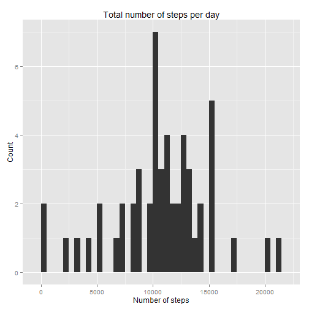
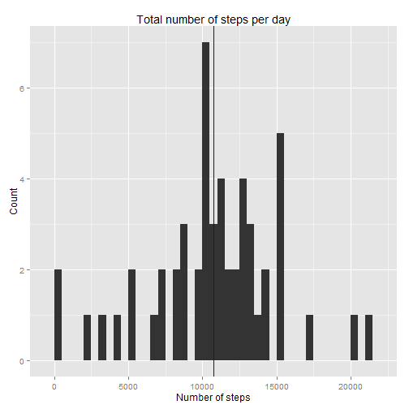
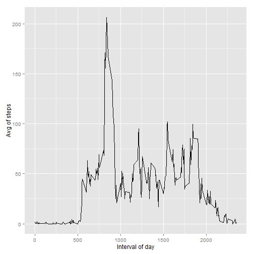
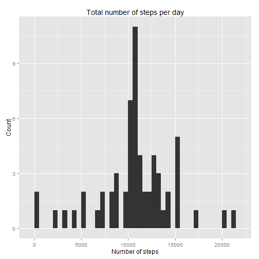
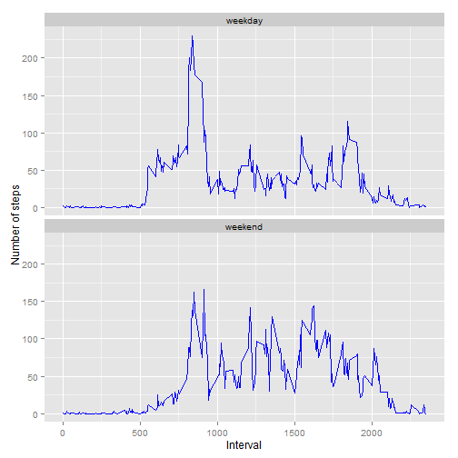

## Loading and preprocessing the data


- Loading the complete data from the zip file:

```r
data <- read.csv(unzip ("activity.zip"))
```

- Saving the date as factor type

```r
data$date<-as.factor(data$date)
```

- Filtering the data, to keep a set without missing values:

```r
data_nna<-data[!is.na(data$steps),]
```
## What is mean total number of steps taken per day?

- For data manipulation, I use dplyr package:

```r
library("dplyr")
```

1. Calculate the total number of steps taken per day:
(Ignoring the missing values)
   

```r
sumperday<-summarise(group_by(data_nna[, c("date", "steps"),], date), sumsteps=sum(steps))
```

2. Histogram of the total number of steps taken each day.
ggplot2 package has been used for the graphics.

```r
library("ggplot2")
```

```r
q<-qplot(sumsteps, data=sumperday, geom="histogram", binwidth = 500)
q  + xlab("Number of steps")  + ylab("Count") + ggtitle("Total number of steps per day")
```

 

3. Calc and report of the mean and median of the total number of steps taken per day.

The mean is:

```r
mean(sumperday$sumsteps)
```

```
## [1] 10766.19
```
The Median is:

```r
median(sumperday$sumsteps)
```

```
## [1] 10765
```
As these values are too close, and due to the graphic resolution, they looks like the same line in the graphic

```r
q+
geom_vline(data = sumperday, aes(xintercept=mean(sumsteps)), colour="red")+
geom_vline(data = sumperday, aes(xintercept=median(sumsteps)), colour="blue") +
xlab("Number of steps")  + ylab("Count") + ggtitle("Total number of steps per day")
```

 

## What is the average daily activity pattern?

1. Time series plot of the 5-minute interval (x-axis) and the average number of steps taken, averaged across all days (y-axis)

```r
avginterdata<-summarise(group_by(data_nna[, c("interval","steps"),], interval), avgsteps=mean(steps))

ggplot(avginterdata, aes(interval, avgsteps)) + geom_line() +
xlab("Interval of day") + ylab("Avg of steps")
```

 

2. The interval with the maximum number of steps is:

```r
avginterdata[which.max(avginterdata$avgsteps), c("interval")]
```

```
## Source: local data frame [1 x 1]
## 
##   interval
## 1      835
```

## Imputing missing values

1. The total missing values is:

```r
data_na<-data[is.na(data$steps),]
length(data_na[,1])
```

```
## [1] 2304
```
2. The missing values will be replaced with the average of the steps for the same interval, calculated in the complete cases, across all the days:
- The variable "data_na"" contains all the data with missing values, and "avginterdata"
contains the averages per interval.
- Doing a join by same "interval", the average step is added to the corresponding interval.

```r
data_nar<-left_join(data_na, avginterdata, by=c("interval"))

data_nar$steps<-round(data_nar$avgsteps)
```
- The variable "steps" for the rows which did not have this value before, is replaced with the new value calculated.

3. The new data set, is a copy of the original data set but with the missing data replaced with values. This new set "newdata", is the result of bind the data without missing values (data_nna), and the new data with replacements (data_nar) 

```r
newdata<-rbind(data_nar[,c("interval", "steps", "date")], data_nna)
```

4. Histogram of the total number of steps taken each day, using the new data.

```r
sumperday2<-summarise(group_by(newdata[, c("date", "steps"),], date), sumsteps=sum(steps))
qplot(sumsteps, data=sumperday2, geom="histogram", binwidth = 500)+
xlab("Number of steps")  + ylab("Count") + ggtitle("Total number of steps per day")
```

 

The mean is:

```r
mean(sumperday2$sumsteps)
```

```
## [1] 10765.64
```
The Median is:

```r
median(sumperday2$sumsteps)
```

```
## [1] 10762
```

- Considering the scale of the sum of steps (From 0 to 20000+), the mean does not change. The median practically does not change, although it shows a difference of 3 units. This could happen because the median depend on the distribution of the data, and the added replaced values can influence that distribution.

## Are there differences in activity patterns between weekdays and weekends?

1. New factor variable (daytype) created in the data set with two levels - "weekday" and "weekend" indicating whether a given date is a weekday or weekend day.


```r
newdata$daytype <- ifelse(weekdays(as.Date(newdata$date)) %in% c("Saturday", "Sunday"), "weekend", "weekday")
```

2. Panel plot containing a time series plot (i.e. type = "l") of the 5-minute interval (x-axis) and the average number of steps taken, averaged across all weekday days or weekend days (y-axis).


```r
avginterdata2<-summarise(group_by(newdata[, c("interval","steps", "daytype"),], interval, daytype), avgsteps=mean(steps))

sp <- ggplot(avginterdata2, aes(x=interval, y=avgsteps)) + geom_line(colour="blue")
sp + facet_wrap( ~ daytype, ncol=1) + xlab("Interval") + ylab("Number of steps")
```

 

The distribution of the steps by interval during the weekends in general is similar during the weekdays, although in the intervals of more activity (between the interval 500 and 2000 ) it seems on weekends there is more activity than weekdays, but is on weekdays that the maximum activity is reach.
